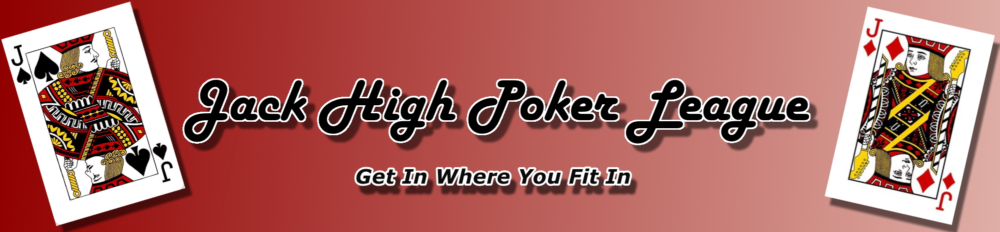

## JHPL Leader Board Update 

Hello JHPL members. This is your update for all things JHPL as of `r Sys.Date()`.

First of all, thank you for playing JHPL. We have had another fun season so far and there is more to come. In the table below, many of the games statistics of interest are displayed. Of particular interest is the Total Points and the Top 5 Points. The total points represent the total points accumulated from all tournaments played this year and will be used ot determine the overall season winner as well as determine each players starting stack size in the final free-roll tournament.  

For those who are in on the points pool, you want to review the top 5 points which represents the top five Main Event tournament points scores for the season so far. All statistics are sortable.  

Here are our current leaders:

```{r, echo=FALSE,warning=FALSE, message=FALSE}
#library(DT)
library(dplyr)
load("Leaderboard_All.RData")

df<- Leaderboard_All %>% select(-c(7,8,9,12,13))

Leader.Table<-DT::datatable(df,colnames = c('Name', 'Player', 'Games Played', 'Cashes', 'Bubble','KOs','Top 5 Points','Points'),options = list(pageLength = 10))

#,options = list(pageLength = 20),width=500)%>%
#  formatCurrency(c("Paid","Bounties","Winnings")) %>%
#  formatPercentage(c("ITM","ROI"))

Leader.Table

```

## Cashes
For some additional statistics for you I have included a table showing the number of cashes, the percent each player has been in the money (ITM) and each players return on investment (ROI).

```{r, echo=FALSE, warning=FALSE, message=FALSE}
library(dplyr)

df<- Leaderboard_All %>% select(-c(3,4,5,6,10,11))
Leader.Table<-DT::datatable(df,colnames = c('Name', 'Player', 'Paid','Bounties Won','Tournament Winnings','ITM','ROI'),options = list(pageLength = 10))%>%
  DT::formatCurrency(c("Paid","Bounties","Winnings")) %>%
  DT::formatPercentage(c("ITM","ROI"))
Leader.Table
```


## Upcomming Events


```{r, echo=FALSE, warning=FALSE, message=FALSE, fig.align="center"}
library(calendR)
library(ggplot2)
library(lubridate)

MainEvents <- as.Date(c("2024-06-27","2024-07-11","2024-08-29"))
DeepStack <- as.Date("2024-08-11")


Days_elapsed <- yday("2024-05-31")
n_MainEvents <- yday(MainEvents)-Days_elapsed

Events <- rep(NA,92)

for (i in n_MainEvents) {
  Events[i]<-"Main Event Tournament"
}

n_DeepStack <- yday(DeepStack)-Days_elapsed

Events[n_DeepStack]<- "$55 Deep Stack Tournament"

# Creating the calendar with a legend
calendR(year = 2024,from=as.Date("2024-06-01"), to=as.Date("2024-08-31"),
        special.days = Events,
        special.col = c("lightsalmon","lightgreen"),
        legend.pos = "bottom",
        title = "June Through August 2024",
        papersize="A4") # Legend to the right

```
